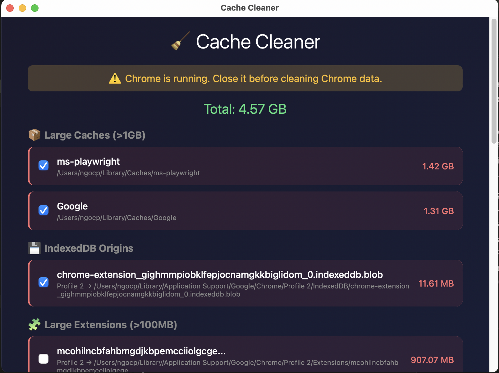

# clean-macos

Fast, safe, and efficient macOS system cleanup utilities.

## Overview

`Cache Cleaner App` là ứng dụng desktop dọn dẹp hệ thống macOS được xây dựng với Rust + Tauri. Ứng dụng cung cấp giao diện đồ họa trực quan và an toàn để quản lý và dọn dẹp các cache trên macOS.



## Features

Ứng dụng desktop dọn dẹp cache được xây dựng với Rust + Tauri, cung cấp giao diện đồ họa trực quan và an toàn:

- **📦 npm Cache** - Dọn dẹp thư mục `~/.npm`
- **🌐 Chrome Cache** - Dọn dẹp cache Chrome tại `~/Library/Caches/Google/Chrome`
- **📁 .cache Directory** - Dọn dẹp thư mục `~/.cache`
- **💾 IndexedDB Origins** - Quét và dọn dẹp IndexedDB của các website (>10MB)
- **📦 Large Caches** - Tìm và xóa các cache lớn (>1GB) trong `~/Library/Caches`
- **👁 Dry-run Preview** - Xem trước những gì sẽ bị xóa trước khi dọn dẹp
- **⚠️ Chrome Detection** - Cảnh báo nếu Chrome đang chạy
- **🔒 Permission Checks** - Kiểm tra quyền truy cập file system
- **📊 Progress Tracking** - Theo dõi tiến trình dọn dẹp với thanh progress bar
- **✅ Selective Cleaning** - Chọn lọc các mục cần dọn dẹp

## Quick Start

### Requirements

- macOS 10.15+ (Catalina trở lên)
- Rust 1.70+ (để build từ source)
- Node.js 18+ (cho Tauri CLI)

### Installation từ Source

1. Clone repository:
```bash
git clone https://github.com/yourusername/clean-macos.git
cd clean-macos/cache-cleaner-app
```

2. Cài đặt Tauri CLI:
```bash
cargo install tauri-cli
```

3. Chạy ở chế độ development:
```bash
cd src-tauri
cargo tauri dev
```

4. Build cho production:
```bash
cargo tauri build
```

File `.app` sẽ được tạo trong `src-tauri/target/release/bundle/macos/`

### Build Universal Binary (Intel + Apple Silicon)

```bash
# Thêm cả hai targets
rustup target add x86_64-apple-darwin
rustup target add aarch64-apple-darwin

# Build universal binary
cargo tauri build --target universal-apple-darwin
```

### Sử dụng App

1. **Mở ứng dụng** - Khởi chạy Cache Cleaner từ Applications hoặc file `.app`

2. **Quét cache** - Nhấn nút "🔍 Scan" để tìm tất cả các cache lớn:
   - IndexedDB Origins (>10MB)
   - Large Caches (>1GB)

3. **Xem trước** - Nhấn "👁 Preview" để xem dung lượng sẽ được giải phóng (không xóa thực sự)

4. **Chọn mục cần dọn** - Tích chọn các mục bạn muốn xóa

5. **Dọn dẹp** - Nhấn "🗑 Clean Selected" và xác nhận để bắt đầu dọn dẹp

### Lưu ý

- ⚠️ **Đóng Chrome trước khi dọn Chrome cache** - App sẽ cảnh báo nếu Chrome đang chạy
- ⚠️ **Xóa IndexedDB sẽ xóa dữ liệu website** - Các website sẽ mất dữ liệu đã lưu
- ✅ **Luôn dùng Preview trước** - Để đảm bảo bạn không xóa nhầm dữ liệu quan trọng

## Documentation

### Cấu trúc Project

```
cache-cleaner-app/
├── src-tauri/
│   ├── src/
│   │   ├── main.rs           # Tauri entry + commands
│   │   ├── cache/
│   │   │   ├── mod.rs        # Cache types & structs
│   │   │   ├── scanner.rs    # Cache detection
│   │   │   ├── cleaner.rs    # Cache deletion
│   │   │   ├── npm.rs        # npm-specific logic
│   │   │   ├── chrome.rs     # Chrome-specific logic
│   │   │   ├── cache_dir.rs  # .cache logic
│   │   │   ├── indexeddb.rs # IndexedDB scanning
│   │   │   └── large_caches.rs # Large cache detection
│   │   └── utils/
│   │       ├── filesystem.rs # File operations
│   │       └── permissions.rs# macOS permissions
│   ├── Cargo.toml
│   └── tauri.conf.json
└── ui/
    └── index.html            # Frontend UI
```

### Các loại Cache được hỗ trợ

| Loại Cache | Đường dẫn | Mô tả |
|------------|-----------|-------|
| **npm Cache** | `~/.npm` | Cache của npm packages |
| **Chrome Cache** | `~/Library/Caches/Google/Chrome` | Cache của Google Chrome |
| **.cache Directory** | `~/.cache` | Thư mục cache chung |
| **Large Extensions** | `~/Library/.../Chrome/Extensions/` | Chrome extensions lớn (>100MB) |
| **IndexedDB** | `~/Library/.../Chrome/.../IndexedDB/` | Dữ liệu IndexedDB của websites (>10MB) |
| **Large Caches** | `~/Library/Caches/*` | Các cache lớn trong Library/Caches (>1GB) |

### Tính năng Safety

- **Dry-run Mode**: Xem trước dung lượng sẽ được giải phóng mà không xóa thực sự
- **Chrome Detection**: Tự động phát hiện và cảnh báo nếu Chrome đang chạy
- **Permission Checks**: Kiểm tra quyền truy cập file system trước khi thực hiện
- **Confirmation Dialog**: Yêu cầu xác nhận trước khi xóa (đặc biệt với extensions và IndexedDB)
- **Progress Tracking**: Hiển thị thanh tiến trình khi đang dọn dẹp
- **Error Handling**: Xử lý lỗi an toàn và thông báo rõ ràng

### Performance

- **Quét nhanh**: Sử dụng Rust async để quét cache hiệu quả
- **Xóa song song**: Xử lý nhiều mục đồng thời khi có thể
- **UI responsive**: Giao diện không bị đơ trong quá trình xử lý

## Requirements

- macOS 10.15+ (Catalina trở lên)
- Rust 1.70+ (để build từ source)
- Node.js 18+ (cho Tauri CLI)

## Compatibility

- ✅ Apple Silicon (M1/M2/M3)
- ✅ Intel Macs
- ✅ macOS Monterey, Ventura, Sonoma
- ✅ APFS and HFS+ file systems
- ✅ External drives (USB, Thunderbolt)

## Safety & Best Practices

### Before First Use

1. **Luôn dùng Preview trước** - Nhấn nút "👁 Preview" để xem dung lượng sẽ được giải phóng
2. **Đóng Chrome trước khi dọn** - App sẽ cảnh báo nếu Chrome đang chạy
3. **Kiểm tra kỹ các mục được chọn** - Đặc biệt với Extensions và IndexedDB
4. **Bắt đầu với ít mục** - Test với một vài mục nhỏ trước

### Production Use

- Luôn sử dụng Preview mode trước khi dọn dẹp thực sự
- Đóng Chrome trước khi dọn Chrome cache
- Xóa IndexedDB sẽ làm mất dữ liệu website - cẩn thận với các website quan trọng
- Kiểm tra quyền truy cập file system nếu gặp lỗi permission

### Known Limitations

- Chrome phải được đóng trước khi dọn Chrome cache
- Xóa IndexedDB sẽ làm mất dữ liệu đã lưu của websites
- Spotlight có thể reindex sau khi xóa cache lớn

## Contributing

Contributions are welcome! This is an early-stage project with room for expansion.

### Development

To contribute:

1. Fork the repository
2. Create a feature branch: `git checkout -b feature-name`
3. Make your changes
4. Test thoroughly on macOS
5. Submit a pull request


## License

MIT License - see LICENSE file for details

## Acknowledgments

Inspired by the need for efficient cache management on macOS, especially with large cache folders that can take up significant disk space.

## Support

- **Issues**: [GitHub Issues](https://github.com/yourusername/clean-macos/issues)
- **Discussions**: [GitHub Discussions](https://github.com/yourusername/clean-macos/discussions)

## Changelog

### v1.0.0 (Initial Release)

- ✨ Cache Cleaner Desktop App với giao diện đồ họa
- ✨ Hỗ trợ dọn dẹp npm, Chrome, và .cache directories
- ✨ Quét và dọn dẹp IndexedDB origins (>10MB)
- ✨ Tìm và xóa Large Caches (>1GB)
- ✨ Dry-run preview mode
- ✨ Chrome running detection
- ✨ Progress tracking với progress bar
- ✨ Selective cleaning với checkboxes
- ✨ Apple Silicon và Intel Mac compatibility

---

**Made with ❤️ for macOS power users**
