# Cache Cleaner App - Architecture Documentation

## 📋 Tổng Quan

Cache Cleaner App là một ứng dụng desktop được xây dựng bằng **Tauri** (Rust + HTML/JS), chuyên dụng cho việc quét và dọn dẹp các loại cache trên macOS. Ứng dụng sử dụng kiến trúc modular với các scanner chuyên biệt cho từng loại cache.

---

## 🏗️ High-Level Architecture

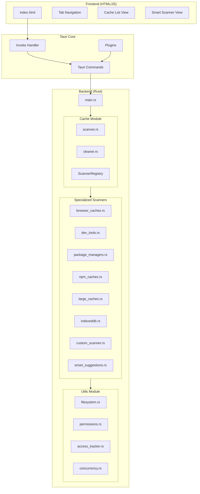

---

## 📦 Module Structure

```mermaid
graph LR
    subgraph src-tauri/src
        main[main.rs]
        
        subgraph cache["cache/"]
            mod[mod.rs]
            scanner[scanner.rs]
            cleaner[cleaner.rs]
            registry[registry.rs]
            scanner_trait[scanner_trait.rs]
            parallel_scanner[parallel_scanner.rs]
            custom_scanner[custom_scanner.rs]
            smart_suggestions[smart_suggestions.rs]
            browser_caches[browser_caches.rs]
            dev_tools[dev_tools.rs]
            package_managers[package_managers.rs]
            npm_caches[npm_caches.rs]
            large_caches[large_caches.rs]
            indexeddb[indexeddb.rs]
            paths[paths.rs]
            config[config.rs]
            cache_dir[cache_dir.rs]
        end
        
        subgraph utils["utils/"]
            utils_mod[mod.rs]
            filesystem[filesystem.rs]
            permissions[permissions.rs]
            access_tracker[access_tracker.rs]
            concurrency[concurrency.rs]
        end
    end
    
    main --> mod
    main --> utils_mod
    mod --> scanner
    mod --> cleaner
    mod --> registry
```

---

## 🔄 Data Flow - Scan Operation

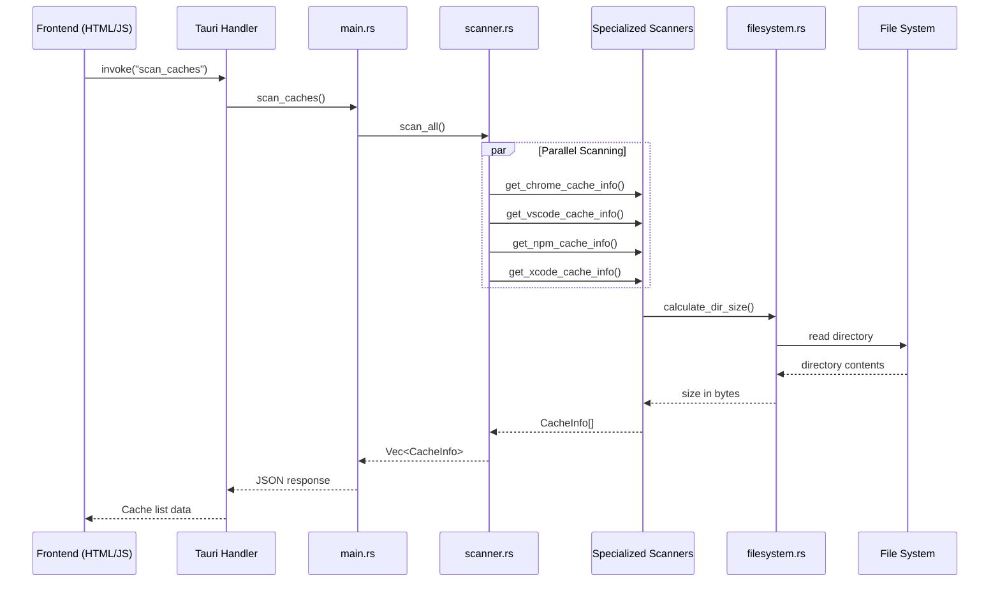

---

## 🧹 Data Flow - Clean Operation

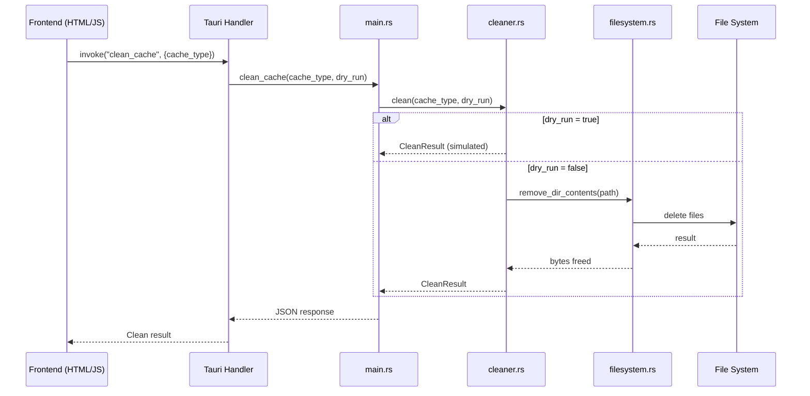

---

## 🎯 Cache Types Supported

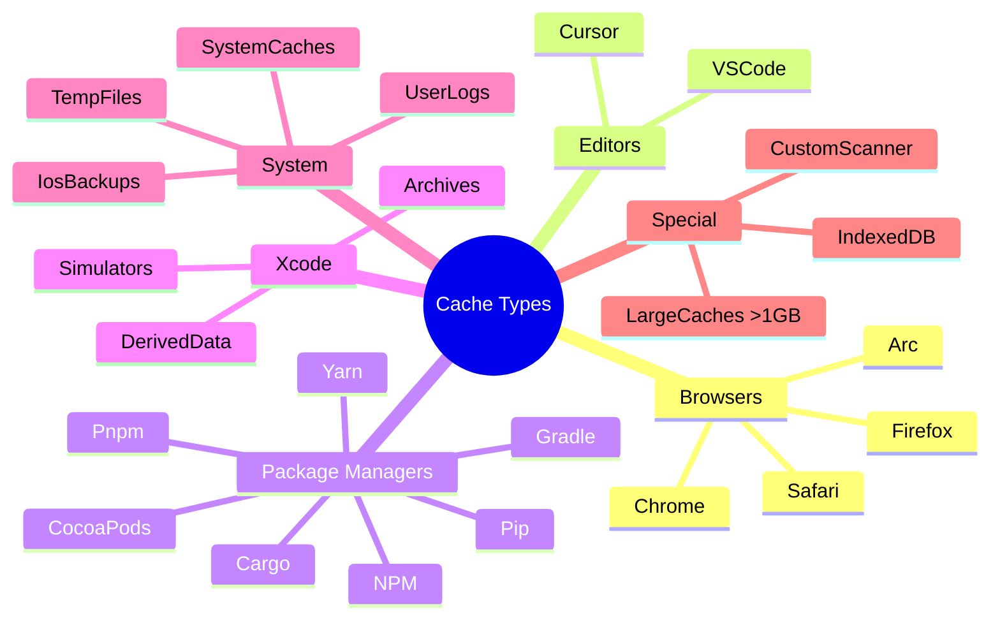

---

## 🔧 Core Components

### 1. Scanner Trait System

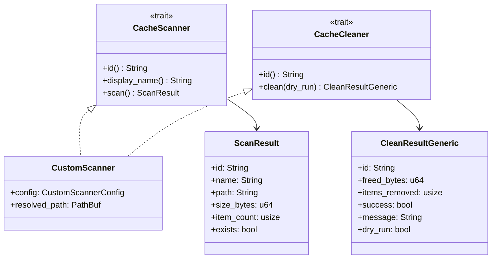

### 2. Scanner Registry

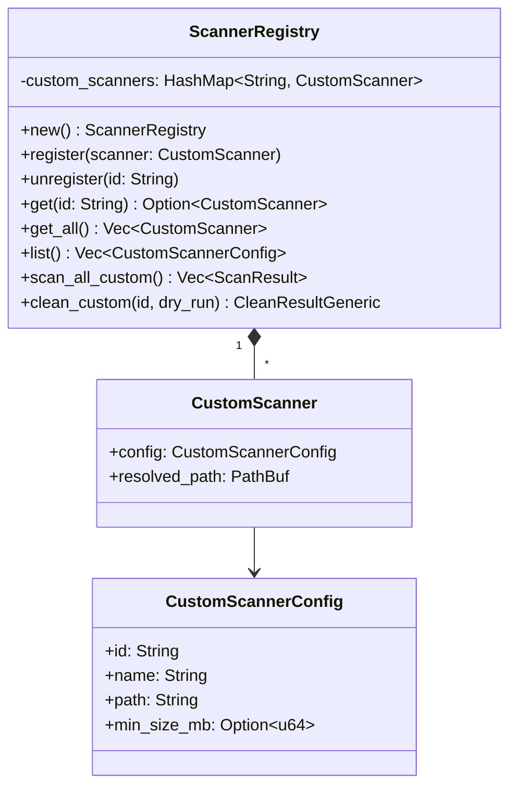

---

## 🧠 Smart Suggestions System

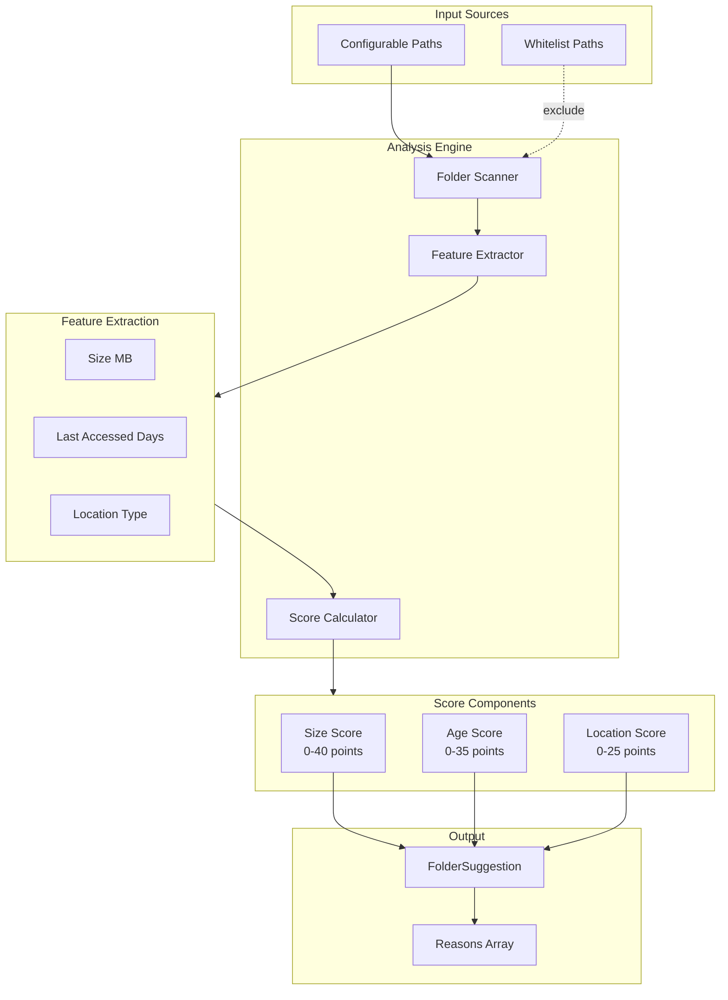

### Score Calculation Logic

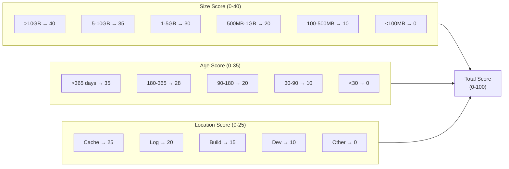

---

## 🖥️ Tauri Commands API

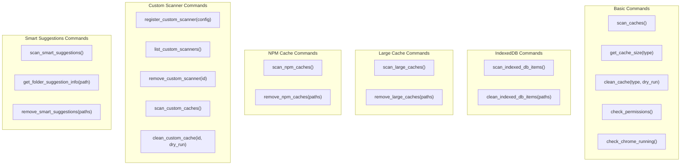

---

## 🔐 Utils Module

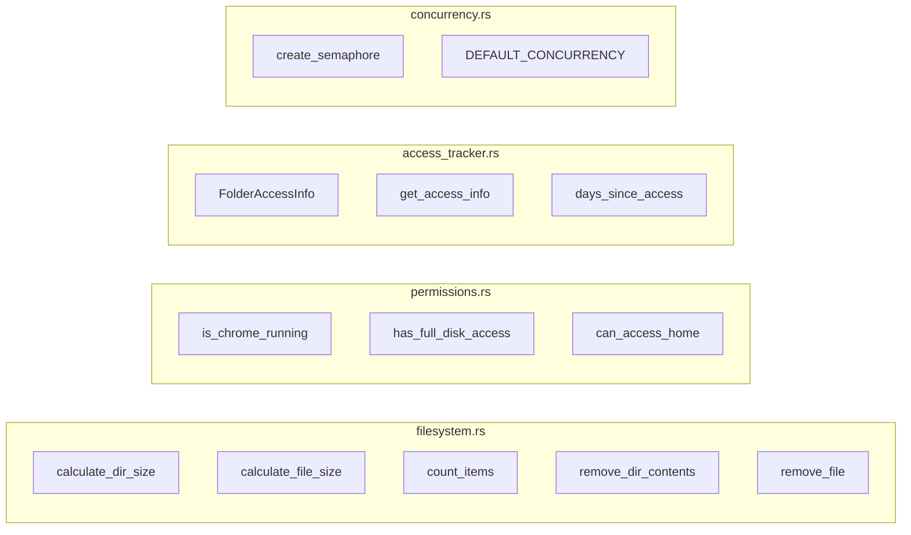

---

## 🎨 Frontend Architecture

```mermaid
flowchart TB
    subgraph UI["index.html"]
        subgraph TabSystem["Tab Navigation"]
            CacheTab[Cache Cleaner Tab]
            SmartTab[Smart Scanner Tab]
        end
        
        subgraph CacheCleanerView["Cache Cleaner View"]
            TotalSize[Total Size Display]
            BasicSection[Editor Caches Section]
            LargeSection[Large Caches Section]
            IndexedSection[IndexedDB Section]
            BrowserSection[Browser Caches Section]
            PackageSection[Package Managers Section]
            DevToolsSection[Dev Tools Section]
            NpmSection[NPM Caches Section]
            CustomSection[Custom Scanners Section]
        end
        
        subgraph SmartScannerView["Smart Scanner View"]
            FilterControls[Filter Controls]
            SuggestionsList[Suggestions List]
            ScoreBadge[Score Badges]
            ReasonsTags[Reasons Tags]
        end
        
        subgraph Actions["Actions"]
            ScanBtn[Scan Button]
            CleanBtn[Clean Button]
            ProgressBar[Progress Bar]
        end
    end
    
    TabSystem --> CacheCleanerView
    TabSystem --> SmartScannerView
    CacheCleanerView --> Actions
    SmartScannerView --> Actions
```

---

## 📊 Data Models

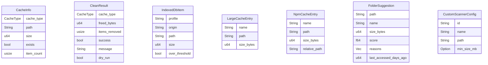

---

## 🚀 Build & Deployment

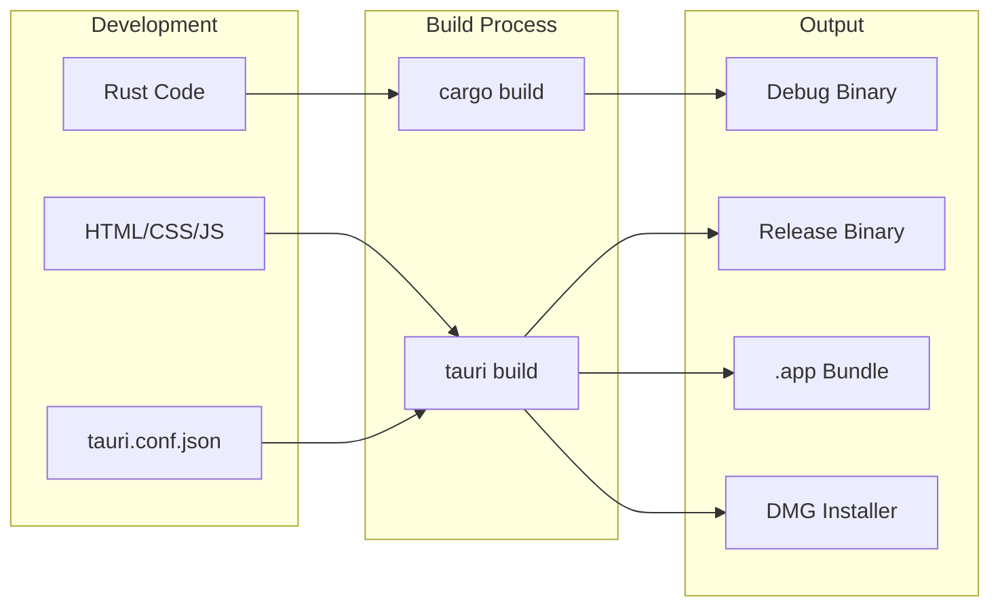

---

## 🔒 Security Considerations

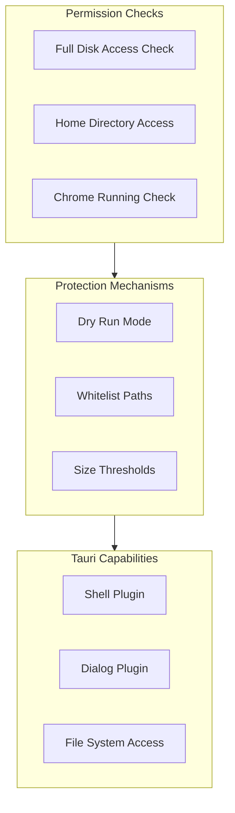

---

## 📈 Performance Optimizations

- **Parallel Scanning**: Sử dụng `tokio` async runtime với semaphore để giới hạn concurrent operations
- **Lazy Loading**: Chỉ load cache info khi cần thiết
- **Incremental Updates**: Progress bar updates trong quá trình clean
- **Efficient Directory Walking**: Sử dụng `std::fs` với recursion optimization

---

## 🔗 Dependencies

| Crate | Purpose |
|-------|---------|
| `tauri` | Desktop app framework |
| `serde` | Serialization/Deserialization |
| `tokio` | Async runtime |
| `dirs` | Cross-platform directory paths |
| `lazy_static` | Static initialization |

---

## 📝 Notes

- Ứng dụng yêu cầu **Full Disk Access** trên macOS để truy cập một số thư mục cache
- Chrome phải được đóng trước khi xóa Chrome cache
- Smart Suggestions sử dụng scoring algorithm để đề xuất folders nên xóa
- Custom Scanner cho phép user định nghĩa paths tùy chỉnh để scan

