# Cache Cleaner App - Technical Deep Dive

## 🎯 Overview Showcase Diagram

```mermaid
%%{init: {'theme': 'dark', 'themeVariables': { 'primaryColor': '#3b82f6', 'primaryTextColor': '#fff', 'primaryBorderColor': '#60a5fa', 'lineColor': '#8b5cf6', 'secondaryColor': '#1e293b', 'tertiaryColor': '#0f172a'}}}%%
flowchart TB
    subgraph App["🧹 Cache Cleaner App"]
        direction TB
        
        subgraph FE["🖥️ Frontend Layer"]
            direction LR
            HTML[HTML/CSS/JS UI]
            Tabs[Tab Navigation]
            Lists[Cache Lists]
            Progress[Progress Indicators]
        end
        
        subgraph Bridge["🌉 Tauri Bridge"]
            direction LR
            IPC[IPC Commands]
            Events[Event System]
            Plugins[Shell & Dialog Plugins]
        end
        
        subgraph BE["⚙️ Backend Layer - Rust"]
            direction TB
            
            subgraph Core["Core Engine"]
                Scanner[🔍 Scanner Engine]
                Cleaner[🗑️ Cleaner Engine]
                Registry[📋 Scanner Registry]
            end
            
            subgraph Specialized["Specialized Modules"]
                Browser[🌐 Browser Caches]
                Editor[📝 Editor Caches]
                Dev[🔧 Dev Tools]
                Package[📦 Package Managers]
                Smart[🧠 Smart Suggestions]
            end
            
            subgraph Infra["Infrastructure"]
                FS[📁 File System Utils]
                Perms[🔐 Permissions]
                Async[⚡ Concurrency]
            end
        end
    end
    
    FE --> Bridge
    Bridge --> BE
    Core --> Specialized
    Specialized --> Infra
    
    style App fill:#0f172a,stroke:#3b82f6,stroke-width:2px
    style FE fill:#1e293b,stroke:#60a5fa
    style Bridge fill:#1e293b,stroke:#8b5cf6
    style BE fill:#1e293b,stroke:#22c55e
```

---

## 🔄 Complete User Flow

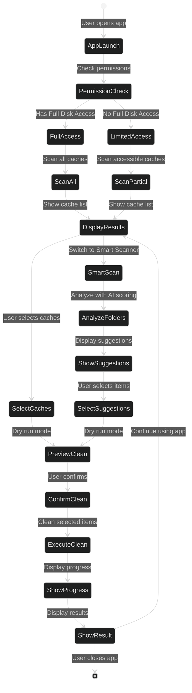

---

## 🏛️ Component Interaction Matrix

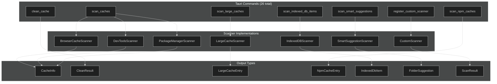

---

## 🧠 Smart Suggestions Algorithm Visualization

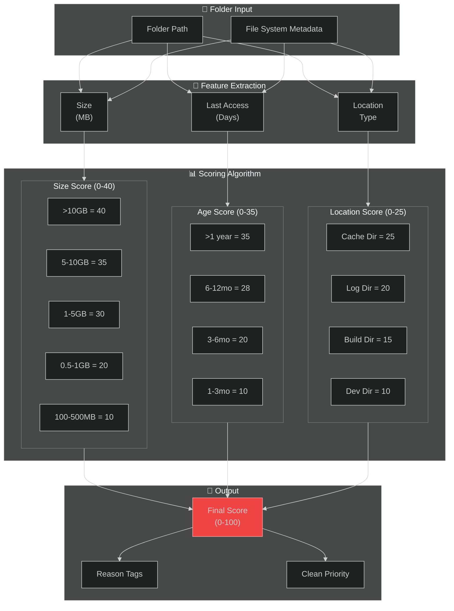

---

## 🗂️ Cache Type Coverage

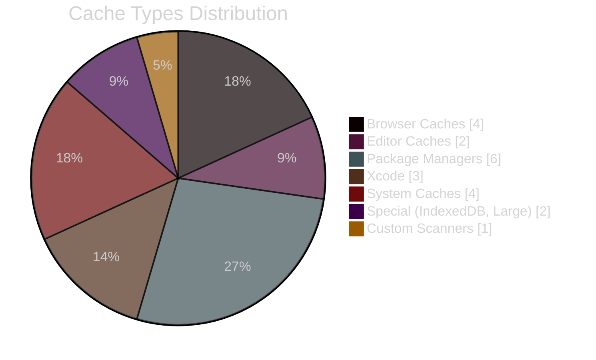

---

## ⚡ Async Processing Flow

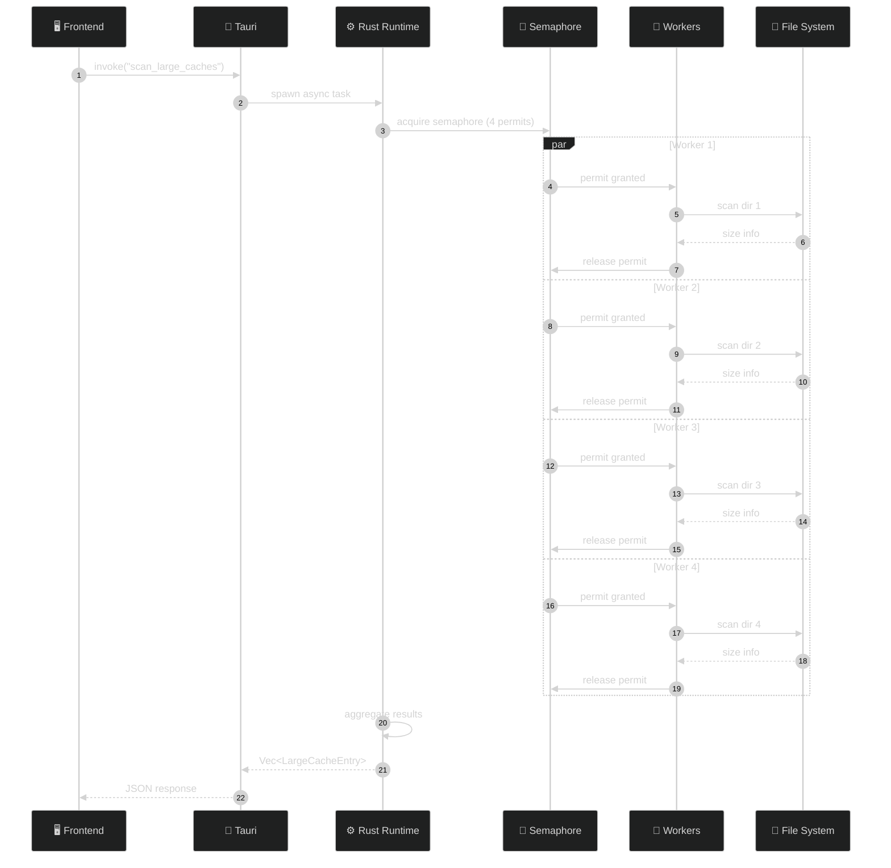

---

## 🔐 Security & Permission Model

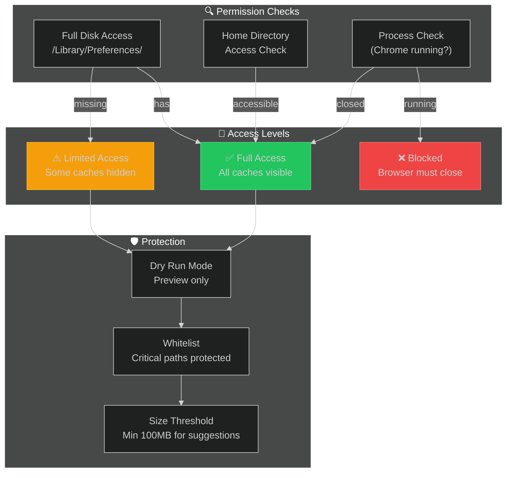

---

## 📱 UI Component Structure

```mermaid
%%{init: {'theme': 'dark'}}%%
graph TB
    subgraph Container["🎨 Main Container"]
        Header["🧹 Cache Cleaner Header"]
        
        subgraph TabNav["Tab Navigation"]
            Tab1["🗂 Cache Cleaner"]
            Tab2["🔍 Smart Scanner"]
        end
        
        subgraph CacheView["Cache Cleaner View"]
            Total["💰 Total Size Display"]
            
            subgraph Sections["Cache Sections"]
                S1["📝 Editor Caches<br/>(VSCode, Cursor)"]
                S2["📦 Large Caches<br/>(>1GB folders)"]
                S3["💾 IndexedDB<br/>(Chrome origins)"]
                S4["🌐 Browser Caches<br/>(Chrome, Safari, Firefox, Arc)"]
                S5["📦 Package Managers<br/>(npm, yarn, pip, cargo...)"]
                S6["🔧 Dev Tools<br/>(Xcode caches)"]
                S7["📁 NPM Global Caches"]
                S8["⚙️ Custom Scanners"]
            end
        end
        
        subgraph SmartView["Smart Scanner View"]
            Filters["🎛️ Filter Controls<br/>(min size, min score)"]
            Suggestions["💡 Suggestions List<br/>(scored folders)"]
        end
        
        subgraph Actions["Action Buttons"]
            Scan["🔍 Scan"]
            Clean["🗑️ Clean Selected"]
        end
        
        Progress["📊 Progress Bar"]
        Status["📋 Status Messages"]
    end
    
    Header --> TabNav
    TabNav --> CacheView
    TabNav --> SmartView
    CacheView --> Total --> Sections
    SmartView --> Filters --> Suggestions
    Sections --> Actions
    Suggestions --> Actions
    Actions --> Progress --> Status
```

---

## 🔄 State Management Flow

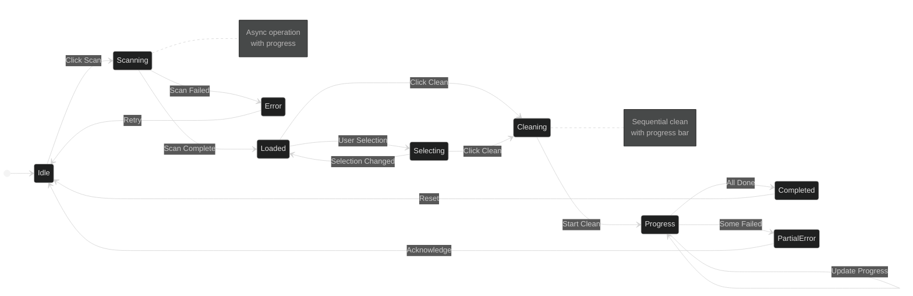

---

## 📈 Performance Metrics

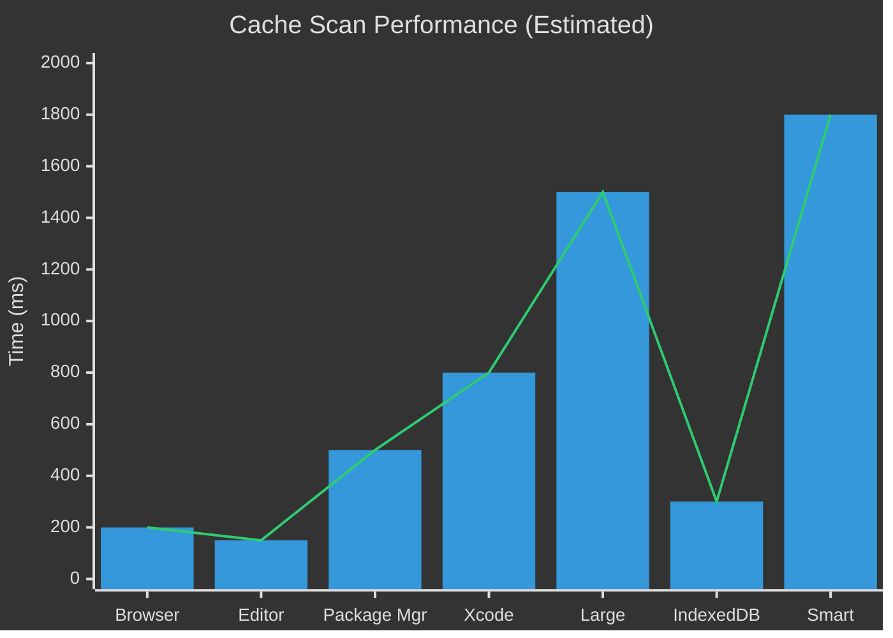

---

## 🎪 Technology Stack Visualization

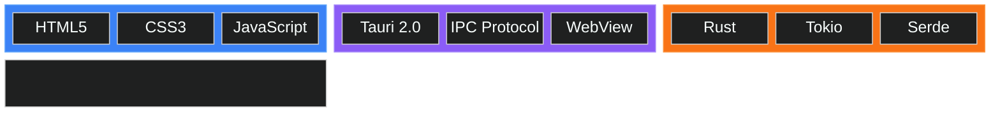

---

## 📋 Summary

| Aspect | Details |
|--------|---------|
| **Framework** | Tauri 2.0 (Rust + WebView) |
| **Language** | Rust (Backend), HTML/JS (Frontend) |
| **Architecture** | Modular Scanner Pattern |
| **Async Runtime** | Tokio |
| **Supported Caches** | 22+ cache types |
| **Special Features** | Smart Suggestions with AI Scoring |
| **Security** | Full Disk Access, Dry Run, Whitelist |
| **Platform** | macOS (primary) |

